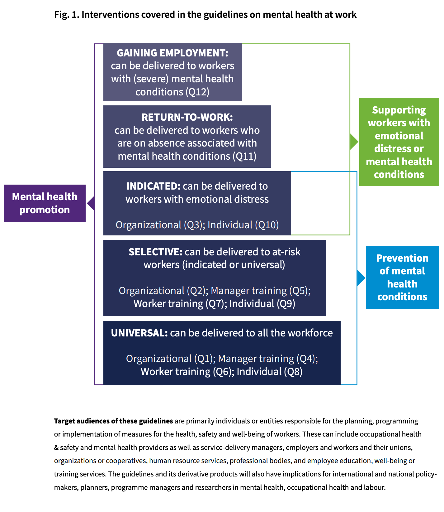

# 初めに
- 本資料は
[WHOの職場のメンタルヘルスガイドライン](https://www.who.int/publications/i/item/9789240053052)を和訳、一部

# Introduction

## Background

> For a large proportion of the global population, mental health and work are integrally intertwined. Mental health is more than the absence of mental health conditions. Rather, mental health is a state of mental well-being that enables people to cope with the stresses of life, to realize their abilities, to learn well and work well, and to contribute to their communities. Mental health conditions occur irrespective of whether work has causally contributed to them. Poor mental health has a negative effect on a person’s cognitive, behavioural, emotional, social and relational well-being and functioning, their physical health, and their personal identity and well-being as related to work. A person’s capacity to participate in work can be consequently impaired through a reduction in productivity and performance, reduction in the ability to work safely, or difficulty in retaining or gaining work. Presenteeism (or lost productivity, which is where the largest financial costs lie), absenteeism and staff turnover affect both workers and employers and, in turn, the society’s economy.

世界の人口の大部分にとって、メンタルヘルスと仕事は一体的に結びついています。メンタルヘルスとは、精神的な健康状態がないこと以上のものです。むしろ、メンタルヘルスは、人々が人生のストレスに対処し、自分の能力を発揮し、よく学び、よく働き、地域社会に貢献することを可能にする精神的な幸福の状態である。メンタルヘルスの状態は、仕事との因果関係の有無に関係なく発生します。精神的健康の悪化は、その人の認知的、行動的、感情的、社会的および人間関係の幸福と機能、身体的健康、そして仕事に関連する個人のアイデンティティと幸福に悪影響を及ぼす。生産性やパフォーマンスの低下、安全に働く能力の低下、仕事の維持や獲得の困難さを通じて、結果として仕事に参加する人の能力が損なわれる可能性がある。プレゼンティーイズム（または生産性の損失、これは最も大きな金銭的コストがかかる）、欠勤、離職は労働者と雇用者の両方に影響を与え、ひいては社会経済にも影響を与えるのです。

> An estimated 15% of working-age adults have a mental disorder at any point in time1 . Globally, as of 2019, 301 million people were living with anxiety,1 280 million people were living with depression, 1 64 million people were living with schizophrenia or bipolar disorder,1 and 703 000 people died by suicide each year (1). Many of these individuals were of working-age. The most prevalent mental health conditions (i.e. common mental disorders such as depression and anxiety), are estimated to cost the global economy US$ 1 trillion each year, with the cost driven predominantly by lost productivity (2). People living with severe mental health conditions – including psychosocial disabilities2 (such as schizophrenia and bipolar disorder) – are, for reasons such as stigma and discrimination, largely excluded from work despite the fact that participation in economic activities is important for recovery.

労働年齢成人の推定15％が、いかなる時点でも精神障害を抱えています1 。世界では、2019年時点で、3億100万人が不安を抱えながら、2億8000万人がうつ病を抱えながら、6400万人が統合失調症または双極性障害を抱えながら生活し、毎年7億3000人が自殺で亡くなっています（1）。これらの人々の多くは労働年齢層であった。最も一般的な精神疾患（うつ病や不安神経症などの一般的な精神疾患）は、世界経済に毎年1兆ドルの損失を与えていると推定され、そのコストは主に生産性の損失によってもたらされています(2)。統合失調症や双極性障害などの心理社会的障害を含む重度の精神疾患を持つ人々は、経済活動への参加が回復に重要であるにもかかわらず、スティグマや差別などの理由から、仕事から大きく排除されています。

> Work is a social determinant of mental health. Meaningful work is protective for mental health; it contributes to a person’s sense of accomplishment, confidence and their earnings, and contributes to recovery and inclusion for people living with psychosocial disabilities. However, harmful or poor working conditions, hazardous work environments and work organization, poor working relationships or unemployment – and the prolonged exposure to these, rather than to positive working conditions – can significantly contribute to worsening mental health or exacerbate existing mental health conditions. There is reasonable consensus on the influence of certain risk factors, also called psychosocial risks (3), on mental health at work. Box 1 lists some of these risk factors, but there are many additional risks which may be specific to certain countries or occupations, and emerging risks are seen as the culture of work changes over time or as the result of major societal events (such a global pandemic or conflict).

仕事はメンタルヘルスの社会的決定要因である。有意義な仕事は、メンタルヘルスを保護する。それは、人の達成感、自信、そして彼らの収入に貢献し、心理社会的障害を持つ人々の回復とインクルージョンに寄与する。しかし、有害で劣悪な労働条件、危険な作業環境と作業組織、劣悪な職場関係や失業、そしてポジティブな労働条件ではなく、これらに長期間さらされることは、メンタルヘルスを悪化させることに大きく寄与するか、既存のメンタルヘルス状態を悪化させる可能性があります。心理社会的リスク(3)とも呼ばれる特定の危険因子が、職場におけるメンタルヘルスに及ぼす影響については、合理的なコンセンサスが得られている。[Box1.](#box1)には、これらのリスク要因のいくつかを挙げているが、特定の国や職業に特有のリスクも多く、また、仕事の文化が時間とともに変化したり、大きな社会的出来事（世界的な流行や紛争など）の結果として、新たなリスクも見られる。

> Society-level events influence mental health and work. Economic recessions or emergencies elicit risks such as job loss, financial instability, organizational restructuring, reduced employment opportunities, increased unemployment, and increased work without full-time or formal contracts (4). Work can be a microcosm for amplifying wider issues which negatively affect mental health, including discrimination and inequality based on sociodemographic factors and their intersectionality, such as age, caste, class, disability, gender identity, migrant status, race/ethnicity, religious beliefs and sexual orientation. While addressing bullying in school-aged persons draws attention, the same cannot be said for the volume of abusive conduct (whether by third parties or between colleagues) experienced by adults at work (5, 6). Most critically, the stigma surrounding mental health conditions remains a dominant barrier to disclosure at work (7), to the implementation of support at work for people living with mental health conditions or, indeed, to the uptake of available support for workers.

社会レベルの出来事が精神衛生と仕事に影響を与える。経済不況や緊急事態は、失業、財政的不安定、組織の再編、雇用機会の減少、失業の増加、フルタイムや正規契約のない仕事の増加などのリスクを誘発する(4)。仕事は、年齢、カースト、階級、障害、性自認、移住の状況、人種・民族、宗教的信念、性的指向などの社会人口学的要因とその交差性に基づく差別や不平等など、メンタルヘルスに悪影響を及ぼすより広い問題を増幅する小宇宙となりうる。学齢期のいじめへの取り組みは注目されているが、職場の大人が経験する虐待行為（第三者によるものか、同僚同士のものか）の量については、同じことは言えない(5, 6)。最も重大なことは、メンタルヘルス疾患を取り巻くスティグマが、職場での情報開示（7）、メンタルヘルス疾患を抱える人々のための職場における支援の実施、あるいは実際に、労働者が利用できる支援の利用を阻む支配的な障壁として残っているということである。

> An estimated two billion workers (over 60% of the global worker population) are in the informal economy (8). Compared to the formal sector, informal workers, who are often women or members of marginalized groups, are not offered social protections that provide access to health care and coupled with low incomes and poor working conditions, risk the likelihood of poor mental health (9–11). In turn, workers who may face greater exposure to psychosocial risks, and who may, but not always, be within the informal economy include agricultural workers, street vendors, domestic workers, casual labourers and may include some family businesses, or the gig economy3 . Changes in the way people work, while benefiting economic development, can also exacerbate work-related stress as workers are increasingly working longer hours. Globally, one third of the workforce is estimated to work more than 48 hours per week, especially in lowerresourced contexts (12). Evolving knowledge on the impacts of changes to flexible working and teleworking, while proving invaluable for some sectors in the context of the COVID-19 pandemic, shows a mixed array of advantages and disadvantages (13).

推定20億人の労働者（世界の労働者人口の60％以上）がインフォーマル経済下にある(8)。フォーマルなセクターと比較して、女性や周縁化されたグループのメンバーであることが多いインフォーマル労働者は、ヘルスケアへのアクセスを提供する社会的保護が提供されず、低所得や劣悪な労働条件と相まって、精神衛生が悪化する可能性が高くなります（9-11）。さらに、心理社会的リスクにさらされる可能性が高く、常にではないが、インフォーマル経済の中にいる可能性のある労働者には、農業労働者、露天商、家事労働者、非正規労働者、そして一部の家族経営やギグエコノミーが含まれる 。働き方の変化は、経済発展に寄与する一方で、労働者の長時間労働を増長させ、労働関連のストレスを悪化させる可能性があります。世界的に見ると、労働者の3分の1は週48時間以上働いていると推定され、特に資源が乏しい地域ではその傾向が顕著である(12)。柔軟な働き方と在宅勤務の変化の影響に関する知識の進展は、COVID-19の流行という状況下で一部のセクターにとって貴重なものとなっているが、利点も欠点もまちまちであることを示している(13)。

> The size of the public health problem of mental health conditions is greater than the volume of investment to address it. This is the case despite international conventions calling for the protection of workers’ physical and mental health through national policies in occupational safety and health (16). Programmes for work-related mental health promotion and prevention of mental health conditions are among the least frequently reported promotion and preventions programmes, by countries (35%) (17).

メンタルヘルス状態という公衆衛生問題の大きさは、それに対処するための投資量よりも大きい。これは、労働安全衛生における国家政策を通じて労働者の身体的・精神的健康を保護することを求める国際条約にもかかわらず、このような状況である(16)。仕事に関連したメンタルヘルスの促進や精神状態の予防のためのプログラムは、国別に見ると、促進や予防のためのプログラムの中で最も報告が少ない（35％）(17)である。

> The promotion of mental well-being and the prevention of mental health conditions have been recognized as means to achieving the global priority for the reduction of premature mortality from noncommunicable diseases (NCDs) by one third (United Nations Sustainable Development Goal, target 3.4). The WHO Comprehensive Mental Health Action Plan, 2013–2030 (18)sets a global objective for promotion and prevention and for the provision of comprehensive, integrated and responsive services in community-based settings (including workplaces). The WHO global strategy on health, environment and climate change (19) identifies workplaces as essential settings for the prevention of a range of modifiable risks, particularly for NCDs. Mental disorders are recognized in the ILO list of occupational diseases which was revised in 2010, under ‘mental and behavioural disorders’.4 Some countries have extended their list to cover work-related stress, burnout, depression and sleep disorders. Some countries also recognize workrelated suicide and include it in their systems of reporting, notification and compensation.

精神的幸福の促進と精神的健康状態の予防は、非感染性疾患（NCD）による早期死亡を3分の1削減するという世界的優先事項（国連の持続可能な開発目標、目標3.4）を達成する手段であると認識されています。WHOの包括的メンタルヘルス行動計画、2013-2030(18)は、プロモーションと予防、およびコミュニティベースの設定（職場を含む）における包括的、統合的、反応性の高いサービスの提供について世界目標を定めている。健康、環境、気候変動に関する WHO の世界戦略(19)では、職場は、特に NCD に関する様々な修正可能なリスクを予防するために不可欠な環境であるとされている。精神障害は、2010年に改訂されたILOの職業病リストで、「精神・行動障害」の項目で認められています。一部の国では、リストを拡張して、業務上のストレス、燃え尽き症候群、うつ病、睡眠障害も対象にしています。また、業務上の自殺を認め、報告、通知、補償の制度に含めている国もある。

> Well-being is a billion-dollar industry, where interventions related to mental health may go unregulated for their quality or evidence base. Although several countries and professional societies have guidelines on the topic of work and mental health, these are specific to the country population. International standards on workplace mental health have been developed, with a specialist focus on the management of psychosocial risks (20).

ウェルビーイングは10億ドル規模の産業であり、メンタルヘルスに関連する介入は、その品質やエビデンスベースについて規制されていない場合があります。いくつかの国や専門学会は、仕事とメンタルヘルスをテーマとしたガイドラインを持っているが、これらはその国の人口に特化したものである。職場のメンタルヘルスに関する国際基準は、心理社会的リスクの管理に専門的に焦点を当て、開発されている(20)。

> Persons of working age spend a significant proportion of their time working. An estimated 62% of the global population aged 15 years and above are economically active (21). Work presents an opportunity to promote good mental health and to prevent and support people living with mental health conditions (22). To date, global evidencebased guidelines for the promotion, prevention and support of mental health related to work are lacking; the above rationale highlights the need for guidelines now.

労働年齢の人々は、その時間のかなりの割合を労働に費やしている。15歳以上の世界人口の62％が経済的に活動していると推定されている(21)。仕事は、良好な精神的健康を促進し、精神的健康状態とともに生きる人々を予防し、支援する機会を提供する(22)。今日まで、仕事に関連したメンタルヘルスの促進、予防、支援のための世界的な証拠に基づくガイドラインは不足している。上記の根拠は、今すぐガイドラインが必要であることを強調している。

## Box1.

職場のメンタルヘルスに対する心理社会的リスク
職場に関連するメンタルヘルス不調（および身体的不調）の危険因子は、10種類に分類されています。 
広く特定されている（14, 15から引用）。 
以下表は@kichinosukeyが編集

| 分類                           | 具体例                                                                                                                                                                                                                                            |
| :----------------------------- | :------------------------------------------------------------------------------------------------------------------------------------------------------------------------------------------------------------------------------------------------ |
| 業務内容・タスクの設計         | 例：多様性の欠如または短い作業サイクル、断片的または無意味な作業、スキルの不十分な使用、高い不確実性。仕事を通じて人と接する機会が多いこと。                                                                                                      |
| 仕事量と仕事のペース           | 例：仕事の過負荷や過少負荷、機械のペース配分、高いレベルのタイムプレッシャー、締め切りに追われ続けるなど。                                                                                                                                        |
| 仕事のスケジュール             | 例：シフト勤務、夜勤、柔軟性のない勤務体系、予測不可能な勤務時間、長時間勤務、非社交的な勤務など。                                                                                                                                                |
| コントロール                   | 例：意思決定への参加が少ない、仕事量やペースをコントロールできないなど。                                                                                                                                                                          |
| 環境と機材                     | 例：機器の利用可能性、適合性、メンテナンスが不十分であること、スペース不足、照明不足、過度の騒音などの環境条件が悪いこと 環境と機器：例えば、機器の利用可能性、適切性、メンテナンスの不備、スペースの不足、照明の不備、過度の騒音などの環境条件。 |
| 組織文化や機能                 | 例：コミュニケーション不足、問題解決や自己啓発に対するサポートの低さ、組織目標の定義や合意の欠如、組織改革、希少資源に対する高い競争、過度に複雑な官僚制。                                                                                        |
| 職場における対人関係           | 例：社会的または物理的な孤立、上司との関係の悪化、対人関係における対立、有害な業務行動、（認識された、または実際に）社会的支援の欠如、いじめ、嫌がらせ、モビング、マイクロアグレッションなど。                                                    |
| 組織における役割               | 例：役割の曖昧さ、役割の衝突、他者への責任など。                                                                                                                                                                                                  |
| キャリア開発                   | 例：キャリアの停滞と不確実性、過小昇進または過大昇進、低賃金、雇用不安、仕事の社会的価値の低さなど。                                                                                                                                              |
| ホームワークのインターフェース | 例：介護の責任がある人、家庭でのサポートが少ない人、二重キャリアの問題など、仕事と家庭の矛盾した要求、仕事をする場所と同じ場所に住む、仕事の割り当て中に家族と離れて暮らすなど。                                                                  |

# ガイドラインの目的

> These guidelines provide recommendations on interventions – defined in further detail below – in the following areas: organizational interventions, manager and worker training and individual interventions for the promotion of positive mental health and prevention of mental health conditions. It also includes recommendations on returning to work following absence associated with mental health conditions and gaining employment for people living with mental health conditions. The guidelines indicate whether and what interventions can be delivered to whole workforces (universal) – e.g. within a workplace – to workers at risk of mental health conditions (selective), for workers experiencing emotional distress (indicated), or for workers already experiencing mental health conditions.

このガイドラインは、以下の領域における介入-以下にさらに詳しく定義する-についての勧告を提供している：ポジティブなメンタルヘルスの促進とメンタルヘルス状態の予防のための組織的介入、管理者と労働者のトレーニング、および個人的介入。また、メンタルヘルス状態に関連した欠勤後の職場復帰や、メンタルヘルス状態とともに生きる人々の雇用の獲得に関する勧告も含まれている。ガイドラインは、どのような介入が職場全体（普遍的）-例えば職場内-に、メンタルヘルス状態のリスクのある労働者（選択的）、感情的苦痛を経験している労働者（示された）、またはすでにメンタルヘルス状態を経験している労働者に提供され得るか、そして何を示す。

> Through the provision of these recommendations, it is anticipated that these guidelines will facilitate national and workplace-level actions in the areas of policy development, service planning and delivery in the domains of mental health and occupational health. The guidelines seek to improve the implementation of evidence-based interventions for mental health at work.

これらの勧告の提供を通じて、このガイドラインが、メンタルヘルスと産業保健の領域における政策立案、サービス計画、提供の領域で、国や職場レベルの活動を促進することが期待される。このガイドラインは、職場におけるメンタルヘルスのためのエビデンスに基づく介入の実施を改善することを目指すものである。

# ガイドラインの適用範囲

> The guidelines focus on civilian adults, aged 18 years5 and above, who are engaged in paid formal or informal work. The guidelines do not address interventions for military personnel or persons exposed to forced labour, trafficking and modern slavery, or child labour. The populations considered in this guideline include all workers with or without known mental health conditions, or persons with mental health conditions or psychosocial disability seeking to gain work or return to work.

本ガイドラインは、有給の正規・非正規労働に従事する 18 歳5 以上の成人市民を対象としている。本ガイドラインは、軍人や強制労働、人身売買、現代の奴隷制度、児童労働にさらされている人への介入は扱っていない。本ガイドラインで考慮する集団には、既知の精神衛生状態の有無に関わらず、すべての労働者、または精神衛生状態や心理社会的障害を持ち、仕事を得ようとする人や仕事への復帰を希望する人が含まれる。

> Workers in at-risk occupations are included, that is, occupations with an increased likelihood of exposure to adverse events (e.g. potentially traumatic events or a series of events which are extremely threatening or horrific) that increase the likelihood of mental health conditions. These include emergency workers (such as national police or fire services), humanitarian workers (international or national), and health workers (23-25)6 . While many occupations face adversities that place them at elevated risk for poor mental health (e.g. due to harmful working conditions), these specific occupations were selected because of frequent requests to WHO for guidelines for these groups. The recommendations for these selective groups of at-risk workers may, however, be applicable to other occupations that are likely to experience disproportionate risks to mental health at work.

リスクのある職業、すなわち、メンタルヘルス状態の可能性を高める有害事象（例えば、潜在的なトラウマとなるような出来事や、極めて脅威的で恐ろしい一連の出来事）にさらされる可能性が高い職業に従事する労働者が含まれる。これには、救急隊員（国の警察や消防など）、人道支援隊員（国際または国内）、保健所職員が含まれる(23-25)6 。多くの職業がメンタルヘルス不調のリスクを高めるような逆境に直面しているが（有害な労働条件など）、これらの特定の職業が選ばれたのは、これらのグループに対するガイドラインを求めるWHOへの要望が頻繁にあったからである。しかし、これらのリスクの高い労働者グループに対する勧告は、職場におけるメンタルヘルスに不釣り合いなリスクを経験する可能性が高い他の職業にも適用できるかもしれない。

> All interventions in these guidelines are delivered in, or are related to, work. Workers may access some interventions outside of a work context, but the intervention has been designed to specifically support workers. The interventions within the scope of the guidelines are as follows:

このガイドラインにあるすべての介入は、仕事の中で行われるか、仕事に関連したものである。労働者は仕事以外の場面でいくつかの介入を受けることができるが、その介入は特に労働者を支援するために設計されている。本ガイドラインの範囲内の介入は以下の通りである。

## Organizational interventions

> These seek to assess, modify, mitigate or remove work-related psychosocial risks to mental health conditions. They are planned actions that directly target working conditions with the aim of preventing deterioration in mental health, physical health, quality of life and work-related outcomes of workers. The interventions can include activities directed at teams. Organizational interventions are often focused on primary and secondary prevention but may also include tertiary prevention (e.g. interventions to support the return to work of workers with mental health problems). Organizational interventions focused on an individual include reasonable accommodations at work (i.e. changes to work to accommodate the person’s needs).

これらは、メンタルヘルス状態に対する業務上の心理社会的リスクを評価、修正、軽減、除去しようとするものである。労働者の精神的健康、身体的健康、生活の質、仕事に関連する成果の悪化を防ぐことを目的とした、労働条件を直接対象とした計画的な行動である。介入は、チームに向けられた活動を含むことができる。組織的介入は、多くの場合、一次予防および二次予防に焦点を当てているが、三次予防（例えば、精神衛生上の問題を抱える労働者の職場復帰を支援するための介入）も含むことができる。個人に焦点を当てた組織的介入には、職場の合理的配慮（本人のニーズに合わせた仕事の変更）が含まれる。

## Training managers and workers

> Manager training for mental health is delivered to workers who supervise others. It aims to build capacity to protect and support the mental health of direct supervisees through, for instance, a manager knowing when and how to support a person. Similar training is also available for workers to support themselves through increased awareness and knowledge of mental health (worker training).

メンタルヘルスに関する管理者研修は、他者を監督する労働者を対象として実施されます。この研修の目的は、例えば、管理者がいつ、どのようにサポートすべきかを知ることで、直接指導する人のメンタルヘルスを保護し、サポートする能力を養うことです。また、メンタルヘルスの意識と知識を高めることで、自分自身をサポートするための同様の研修も用意されています（従事者研修）。

## Individual interventions

> These include interventions delivered directly to a worker (completed by the worker, with or without guidance). They include psychosocial interventions (i.e. interventions that use a psychological, behavioural or social approach, or a combination of these) and leisure-based physical activities such as exercise (not physical labour as a part of work).

これらには、労働者に直接提供される介入（指導の有無に関わらず、労働者によって完了される）が含まれる。心理社会的介入（すなわち、心理的、行動的、社会的アプローチ、またはこれらの組み合わせを用いる介入）や、運動などの余暇を基盤とした身体活動（仕事の一部としての肉体労働ではない）も含まれる。

## Return-to-work programmes 

> This is designed to support workers in a meaningful return to work and in reducing the symptoms of mental ill-health following periods of absence. These can be multi-component interventions combining any mix of individual, manager and organizational interventions.

これは、労働者が有意義な職場復帰をすること、および休職期間後の精神的不健康の症状を軽減することを支援するために考案されたものです。これらは、個人、マネージャー、組織的な介入を組み合わせた多成分介入とすることができる。

## Gaining employment programmes

> In the context of the present guidelines, these interventions are designed to support the entry into paid work of people living with mental health conditions. These are also multi-component interventions. These guidelines also explored screening programmes delivered during employment (reported under key question 13 [Q13]). The aim of the screening is to identify symptoms of mental health, followed by referral to an appropriate level of care. Fig. 1 shows the interventions addressed in these guidelines at different population levels.

本ガイドラインの文脈では、これらの介入は、精神的健康状態とともに生きる人々の有給労働への参入を支援するために設計されています。これらはまた、多成分の介入である。本ガイドラインでは、雇用中に実施されるスクリーニングプログラムも検討されている（重要な質問13［Q13］で報告されている）。スクリーニングの目的は、精神衛生の症状を特定することであり、その後、適切なレベルのケアに紹介することである。図1は、異なる集団レベルにおいて、これらのガイドラインで扱われている介入を示す。

